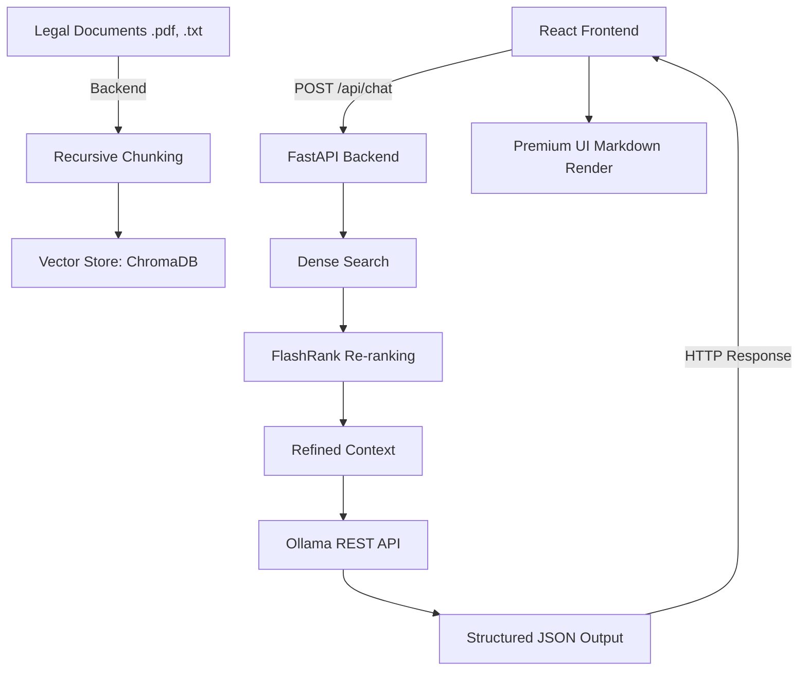

# ⚖️ LegalEase: Advanced RAG-Powered Legal Advisor

[](https://www.python.org/)
[](https://fastapi.tiangolo.com/)
[](https://react.dev/)
[](https://tailwindcss.com/)
[](https://github.com/langchain-ai/langchain)
[](https://www.trychroma.com/)
[](https://github.com/PrithivirajDamodaran/FlashRank)

**LegalEase** is a production-grade Retrieval-Augmented Generation (RAG) system designed to provide precise, grounded answers to complex legal queries. It has been transformed into a modern full-stack web application featuring a highly optimized **FastAPI** Python backend and a stunning **React + Vite + Tailwind CSS** frontend.

---

## 🚀 Key Features

- **Decoupled Architecture**: Independent, lightweight React frontend communicating seamlessly with a dedicated high-performance Python API.
- **Elite Trial-Advocate Persona**: Powered by local/custom Ollama models (`gpt-oss:120b`), generating rich, authoritative legal strategies formatted elegantly in Markdown.
- **Multi-Stage Retrieval Pipeline**:
  - **Dense Retrieval**: High-dimensional semantic search using `all-MiniLM-L6-v2`.
  - **Second-Stage Re-ranking**: Cross-encoder re-ranking via `FlashRank` to eliminate false positives and refine relevance.
- **Advanced Data Processing**:
  - **Semantic Chunking**: Large semantic chunks (1200 characters) to preserve entire articles, section numbers, and citation cohesiveness.
- **Premium UI/UX**: A dark-mode, responsive React interface with interactive legal term cards, scalable Lucide icons, and beautiful Markdown rendering.

---

## 🏗️ Architecture



---

## 🛠️ Tech Stack

### Backend (`/backend`)
- **Core API**: Python, FastAPI, Uvicorn
- **Embeddings**: Sentence-Transformers (`all-MiniLM-L6-v2`)
- **Vector DB**: ChromaDB
- **Re-ranker**: FlashRank (Cross-Encoders)
- **LLM Engine**: Ollama REST API (`gpt-oss:120b`)
- **Evaluation**: Ragas, Pandas

### Frontend (`/frontend`)
- **Framework**: React 18, Vite
- **Styling**: Tailwind CSS v3, PostCSS
- **Icons**: Lucide React
- **Parsing**: React-Markdown

---

## 🏁 Getting Started

### 1. Backend Setup
Navigate into the backend directory and install the python dependencies.
```bash
cd backend
python -m venv .venv
source .venv/bin/activate  # Or .\.venv\Scripts\Activate.ps1
pip install -r requirements.txt
```

Create a `.env` file in the `backend/` directory:
```env
OLLAMA_API_URL=https://ollama.com/api/generate
OLLAMA_API_KEY=your_api_key
OLLAMA_MODEL=gpt-oss:120b
```

Ingest your legal documents (place PDFs in `backend/kb/text/`):
```bash
python ingest.py
```

Start the API Server:
```bash
uvicorn api:app --reload --port 8000
```

### 2. Frontend Setup
Open a new terminal and navigate to the frontend directory.
```bash
cd frontend
npm install
```

Start the Vite development server:
```bash
npm run dev
```

### 3. Usage
Navigate to `http://localhost:5173` in your browser. Enter a legal query, and the application will instantly retrieve the appropriate laws and formulate a strategic trial-advocate response.

---

## 📂 Project Structure
- `/backend`: Python API, RAG logic, ChromaDB, and document ingestion.
- `/frontend`: React application, Tailwind configs, and chat components.

---

## 📜 License
This project is licensed under the MIT License - see the [LICENSE](LICENSE) file for details.
