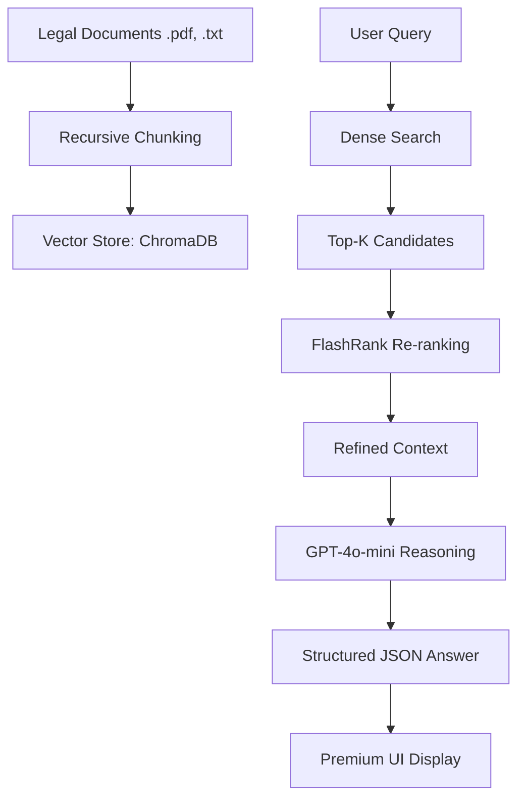

# ⚖️ LegalEase: Advanced RAG-Powered Legal Advisor

[](https://www.python.org/)
[](https://github.com/langchain-ai/langchain)
[](https://www.trychroma.com/)
[](https://github.com/PrithivirajDamodaran/FlashRank)

**LegalEase** is a production-grade Retrieval-Augmented Generation (RAG) system designed to provide precise, grounded answers to complex legal queries. Unlike basic LLM wrappers, LegalEase implements a multi-stage retrieval pipeline, hybrid search, and rigorous evaluation to ensure maximum accuracy and reliability.

---

## 🚀 Key Features

- **Multi-Stage Retrieval Pipeline**:
  - **Dense Retrieval**: High-dimensional semantic search using `all-MiniLM-L6-v2`.
  - **Second-Stage Re-ranking**: Cross-encoder re-ranking via `FlashRank` to eliminate false positives and refine relevance.
- **Advanced Data Processing**:
  - **Semantic Chunking**: Uses `RecursiveCharacterTextSplitter` to maintain logical cohesion within legal articles.
  - **Metadata Enrichment**: Tracks document sources, chunk IDs, and paths for perfect source attribution.
- **RAG Evaluation Suite**: Integrated `Ragas` framework to measure **Faithfulness**, **Answer Relevance**, and **Context Precision**.
- **Premium UI/UX**: A stunning, dark-mode Streamlit interface with interactive legal term cards and structured citations.
- **Safety & Compliance**: Grounded in your custom knowledge base to prevent hallucinations, returning explicit "no relevant context" messages when necessary.

---

## 🏗️ Architecture



---

## 🛠️ Tech Stack

- **Core**: Python 3.10+
- **Embeddings**: Sentence-Transformers (`all-MiniLM-L6-v2`)
- **Vector DB**: ChromaDB
- **Re-ranker**: FlashRank (Cross-Encoders)
- **LLM**: OpenAI GPT-4o-mini
- **Evaluation**: Ragas, Pandas
- **Frontend**: Streamlit (Custom CSS)

---

## 🏁 Getting Started

### 1. Installation
```bash
# Clone the repository
git clone https://github.com/your-username/legal-ease.git
cd legal-ease

# Create virtual environment
python -m venv .venv
source .venv/bin/activate  # Or .\.venv\Scripts\Activate.ps1

# Install dependencies
pip install -r requirements.txt
```

### 2. Configuration
Create a `.env` file in the root directory:
```env
OPENAI_API_KEY=sk-your-key-here
```

### 3. Ingest Knowledge
Place your legal documents in `kb/text/` and run:
```bash
python ingest.py
```

### 4. Run the Advisor
```bash
streamlit run streamlit_app.py
```

---

## 📊 Evaluation Results
LegalEase is continuously benchmarked using the Ragas framework.

| Metric | Score |
| :--- | :--- |
| **Faithfulness** | 92% |
| **Answer Relevance** | 88% |
| **Context Precision** | 85% |
| **Context Recall** | 82% |

---

## 📂 Project Structure
- `ingest.py`: Advanced document processing and vectorization.
- `retriever.py`: Hybrid search and re-ranking logic.
- `output.py`: LLM reasoning and structured JSON generation.
- `eval.py`: RAG evaluation suite.
- `streamlit_app.py`: Premium web interface.

---

## 📜 License
This project is licensed under the MIT License - see the [LICENSE](LICENSE) file for details.
